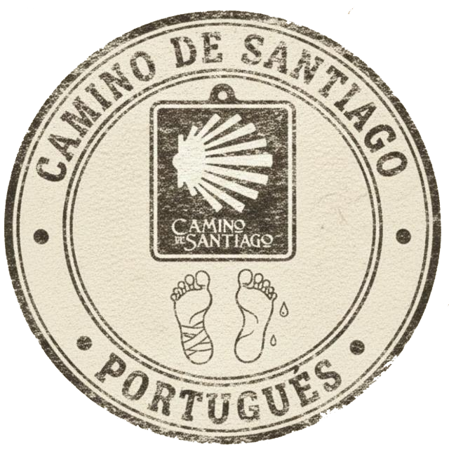

# 🐚 Твою ж Каміно! — Buen Camino 2026

Персональний цифровий супутник для паломництва **Camino Português da Costa**. Створено для групи друзів, що вирушають у подорож 13 липня 2026 року.



## 🌟 Про проєкт

Це прогресивний веб-додаток (PWA), який працює офлайн і містить усе необхідне для виживання та насолоди на шляху до Сантьяго-де-Компостела.

### Основні розділи:
- **📍 Маршрут:** Детальний план на 12 днів з точками інтересу, штампами та альберге.
- **🛏️ Бронювання:** Список усіх заброньованих місць ночівлі.
- **🎒 Спорядження:** Індивідуальні чеклісти речей для кожного паломника.
- **🗣️ Словник:** Найважливіші фрази португальською та іспанською (з транскрипцією!).
- **🍽️ Що з'їсти:** Рандомайзер місцевих страв, щоб не думати над меню.
- **🧘 Вправи:** Гід з підготовки тіла та розтяжки на маршруті.
- **🆘 Безпека:** Екстрені контакти та поради щодо здоров'я (Blister Meter!).

---

## 🏗️ Архітектура та файли

Проєкт побудований на **Vanilla JS** (чистий JavaScript) з використанням **ES Modules** та **CSS-змінних**. Жодних важких фреймворків — лише швидкість та надійність.

### Структура папок:
- `index.html` — єдина точка входу та скелет додатку.
- `sw.js` — Service Worker, що забезпечує роботу в офлайні та кешування статики.
- `assets/css/main.css` — стилі, включаючи світлу/темну теми та спецрежими.
- `assets/js/` — логіка додатку:
    - `main.js` — ініціалізація, роутинг та реєстрація Service Worker.
    - `config.js` — **Єдине джерело істини**. Усі дані про маршрут, паломників, ціни та фрази.
    - `ui.js` — рендеринг HTML-компонентів та взаємодія з DOM.
    - `storage.js` — робота з `localStorage` (збереження чеків, бронювань та стану паломників).
    - `easterEggs.js` — усі таємниці та пасхалки.
    - `utils.js` — допоміжні функції (погода, таймери, конфеті).

---

## 🎮 Як користуватись

1. **Вхід:** Виберіть свого персонажа та введіть пароль (підказки допоможуть).
2. **Навігація:** Використовуйте горизонтальний таб-бар для перемикання розділів.
3. **Деталі дня:** Натисніть на картку дня в маршруті, щоб побачити мапи, поради та погоду.
4. **Чекліст речей:** У розділі "Паломники" натисніть на своє ім'я — там ваш особистий список спорядження.
5. **Нічний режим:** Кнопка 🌙/☀️ у хедері автоматично підлаштовується під час доби або змінюється вручну.

---

## 🕵️ Секрети та пасхалки (Easter Eggs)

Ми додали трохи магії в цей додаток. Спробуйте знайти їх усі:

1. **🐚 Меми:** Швидко натисніть на мушлю в хедері 5 разів.
2. **🌧️ Дощ із мушель:** Довго затисніть логотип "Твою ж Каміно!" на головному екрані (3 сек) або введіть **Konami Code** на клавіатурі (`↑↑↓↓←→←→ba`).
3. **🎬 The Way Mode:** Введіть слово `сантьяго` як пароль при вході або в будь-яке поле вводу секретних команд. Це активує кінематографічний нуар-режим з ефектом старої плівки, звуками шторму та блискавками.
4. **🎂 День народження:** 24 липня додаток автоматично привітає Олексу особливим сюрпризом.
5. **⌨️ Секретні команди (вводити в поле пошуку/команд):**
    - `botafumeiro` — золота тема собору.
    - `fisterra` — глибока океанічна тема "кінця світу".
    - `francesinha` — "смачна" помаранчева тема Порту.
    - `peixe` — секретне фото для Олекси.

---

## 🛠️ Розробка та запуск

Для локальної розробки потрібен будь-який статичний сервер:

```bash
# Якщо є Python
python -m http.server 8080

# Якщо є Node.js
npx serve .
```

### Налаштування Service Worker:
Якщо ви змінили JS або CSS файли, не забудьте оновити `CACHE_NAME` у `sw.js` (наприклад, змінити `v1` на `v2`), щоб користувачі отримали оновлення.

---

## 📜 Ліцензія
Тільки для приватного використання паломниками Camino 2026.

**Buen Camino!** 🐚✨
